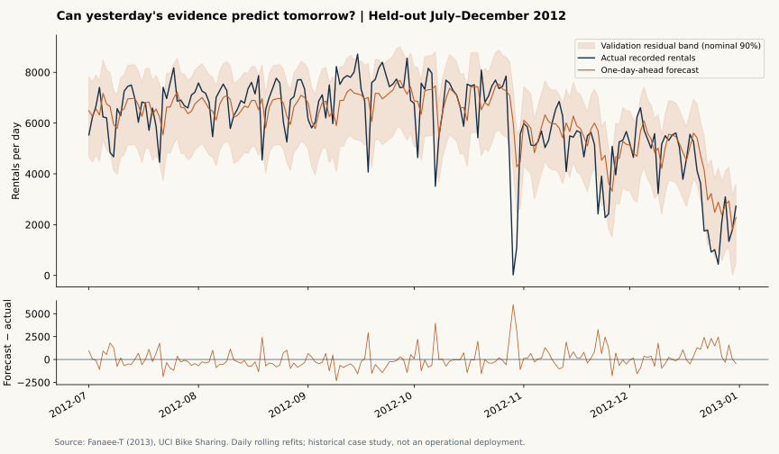
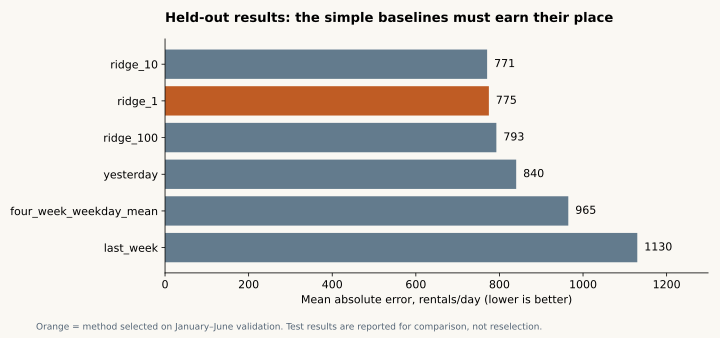

# Tomorrow's bike demand, without tomorrow's evidence

**Root2Raj · Data Science · AI-assisted historical case study**

An operations planner needs a next-day system-wide demand estimate. A shuffled train/test split or same-day weather measurement can make that estimate look better than the information actually available. This project forecasts using only historical rental counts and known calendar inputs, then measures errors on later dates.

## Measured result

| Evidence | Result |
|---|---:|
| Genuine daily source records, 2011–2012 | 731 |
| Untouched final evaluation days | 184 |
| Selected method | `ridge_1` |
| Held-out MAE | 774.7 rentals/day |
| Held-out WAPE | 12.82% |
| MAE reduction vs validation-selected baseline (`yesterday`) | 7.78% |
| Actual coverage of nominal 90% band | 86.41% |

The interval undercovers. The model is useful evidence for comparison, not a promised service level or proof of operational savings.

## Evaluation design

- 2011 establishes the initial training history; 28 days warm up lagged features.
- January–June 2012 selects among three baselines and three predeclared ridge penalties by MAE.
- July–December 2012 is the final evaluation. The chosen method stays frozen; it is refitted daily on up to 365 eligible earlier observations.
- Forecast horizon is **one day**, with yesterday's actual assumed available. This is not a six-month forecast made in June.
- Same-day total, casual/registered components and observed weather are excluded. Holiday flags assume the calendar is available in advance.
- A fixed residual interval is calibrated on validation errors. Its actual coverage is reported separately.

The code writes one audit row per forecast showing the last observed date and training cutoff. Tests perturb future targets to check that past features and model selection remain unchanged.

## Review the evidence

[Run instructions](docs/REPRODUCIBILITY.md) · [Model card](docs/MODEL_CARD.md) · [Decision brief](docs/DECISION_BRIEF.md) · [Metrics](outputs/metrics.json) · [Forecast audit](outputs/forecast_audit.csv) · [Predictions](outputs/predictions.csv) · [Validation](outputs/validation.json)

## Limits

One historical city system, two years, no station inventory or stockout labels. Rental volume is not the number of bicycles required: bicycles can serve multiple rentals. Unexpected weather and events remain unobserved at forecast time. No causal explanation is assigned to large errors. The project was developed with AI assistance and makes no claim of employment or client delivery.

## Source

Fanaee-T, H. (2013). [Bike Sharing, UCI](https://archive.ics.uci.edu/dataset/275/bike+sharing+dataset). DOI [10.24432/C5W894](https://doi.org/10.24432/C5W894). CC BY 4.0. Original files remain unchanged locally; features and aggregates are derived. Code: MIT.
